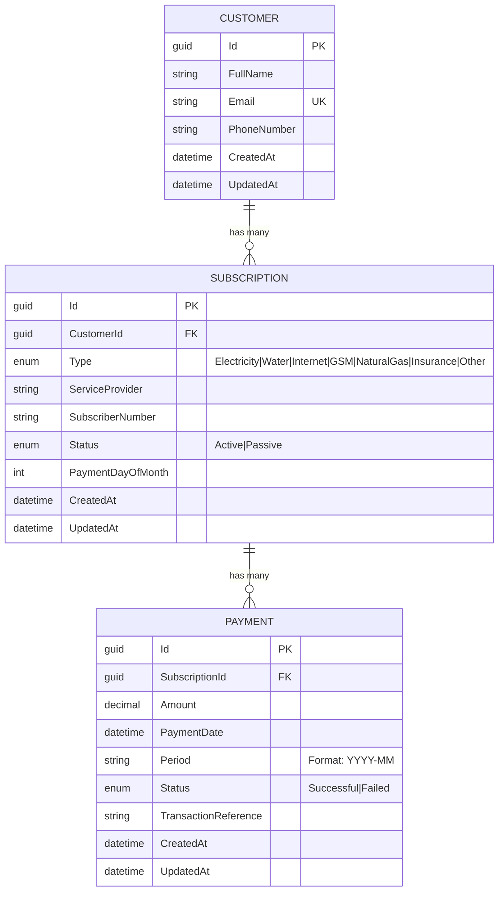

# ER Diagram

## Entity Relationship Diagram

## Table Details

### Customers
| Column | Type | Constraints |
|--------|------|-------------|
| Id | GUID | Primary Key |
| FullName | VARCHAR(150) | NOT NULL |
| Email | VARCHAR(256) | NOT NULL, UNIQUE |
| PhoneNumber | VARCHAR(20) | NOT NULL |
| CreatedAt | DATETIME | NOT NULL |
| UpdatedAt | DATETIME | NULL |

### Subscriptions
| Column | Type | Constraints |
|--------|------|-------------|
| Id | GUID | Primary Key |
| CustomerId | GUID | FK → Customers.Id, CASCADE DELETE |
| Type | VARCHAR(50) | NOT NULL (enum stored as string) |
| ServiceProvider | VARCHAR(200) | NOT NULL |
| SubscriberNumber | VARCHAR(50) | NOT NULL |
| Status | VARCHAR(20) | NOT NULL (Active/Passive) |
| PaymentDayOfMonth | INT | NOT NULL (1-28) |
| CreatedAt | DATETIME | NOT NULL |
| UpdatedAt | DATETIME | NULL |

### Payments
| Column | Type | Constraints |
|--------|------|-------------|
| Id | GUID | Primary Key |
| SubscriptionId | GUID | FK → Subscriptions.Id, CASCADE DELETE |
| Amount | DECIMAL(18,2) | NOT NULL |
| PaymentDate | DATETIME | NOT NULL |
| Period | VARCHAR(7) | NOT NULL (e.g., "2026-05") |
| Status | VARCHAR(20) | NOT NULL (Successful/Failed) |
| TransactionReference | VARCHAR(100) | NULL |
| CreatedAt | DATETIME | NOT NULL |
| UpdatedAt | DATETIME | NULL |

## Indexes

- `IX_Customers_Email` - Unique index on Customer.Email
- `IX_Subscriptions_CustomerId` - Index for customer lookup
- `IX_Payments_SubscriptionId_Period` - Composite index for payment period lookups

