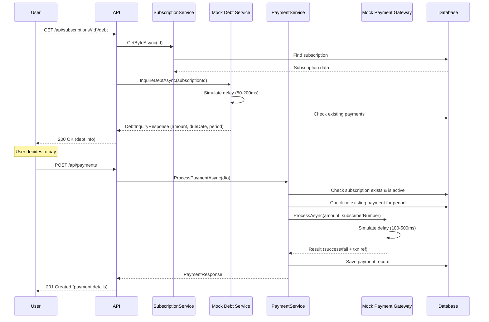
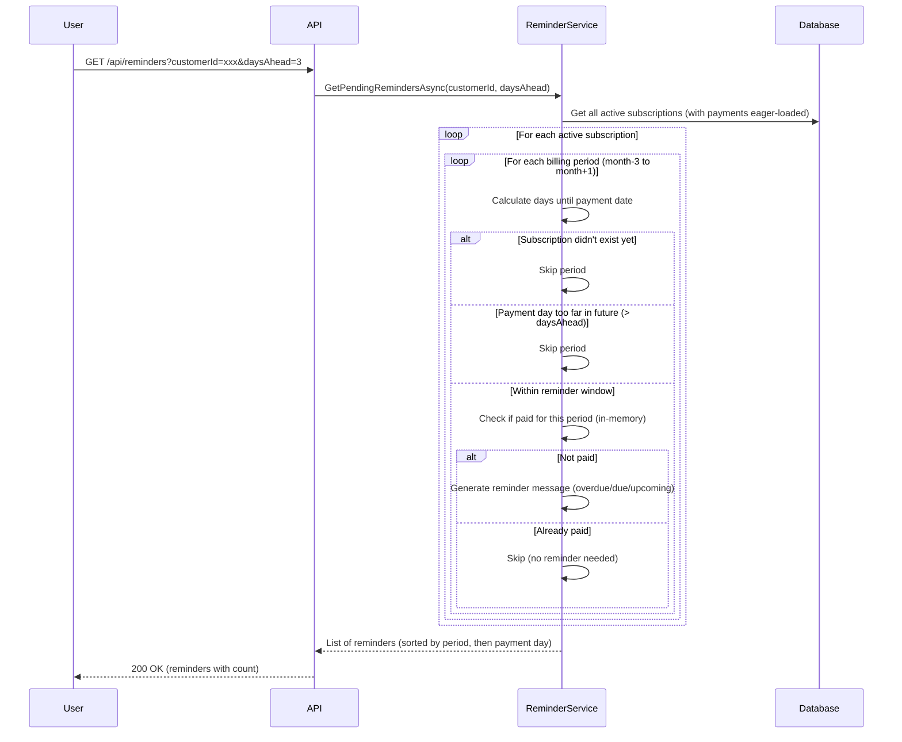
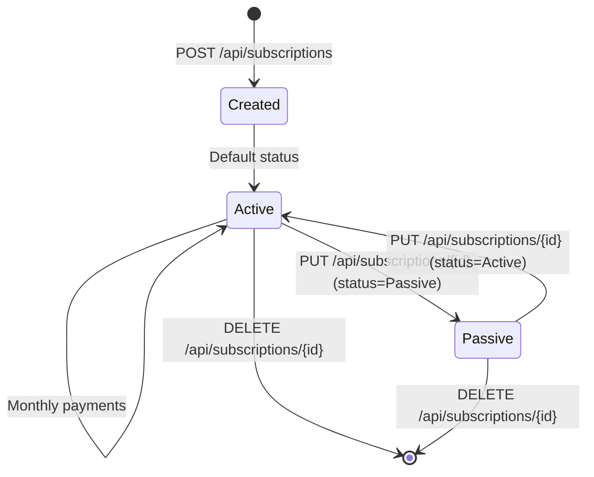
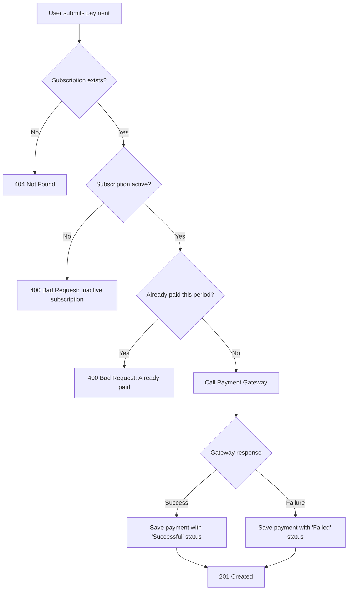
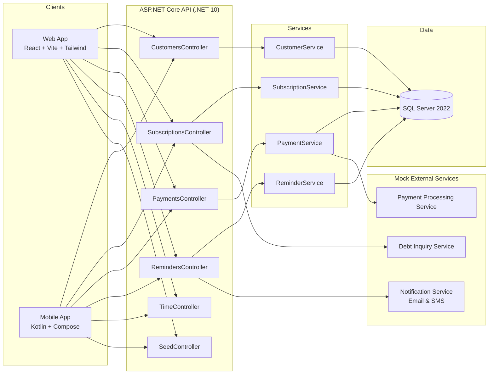
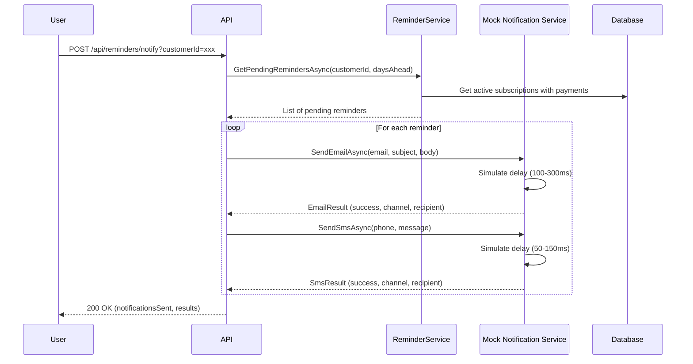
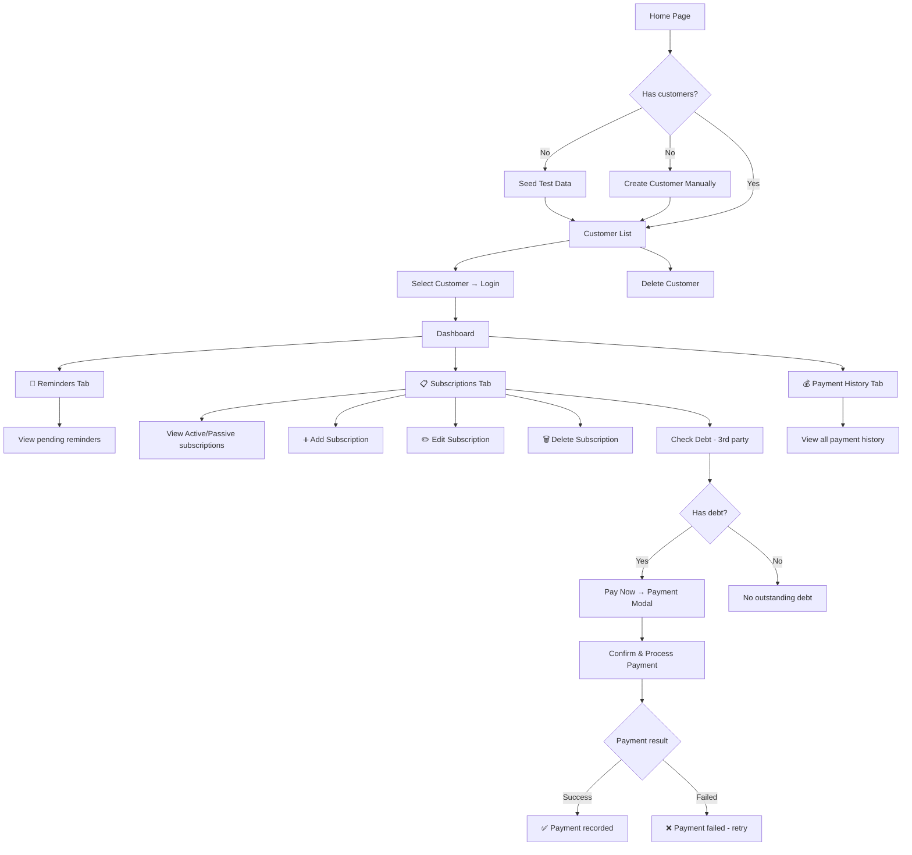

# Flow Diagrams

## 1. Debt Inquiry → Payment Flow

## 2. Reminder Check Flow

## 3. Subscription Lifecycle

## 4. Payment Processing Decision Tree

## 5. Complete System Overview

## 6. Notification Send Flow

## 7. Client User Flow (Web & Mobile)

> Both the React web app and Kotlin Android app follow the same user flow below. The web uses pages/modals, the mobile uses Compose screens/dialogs.

